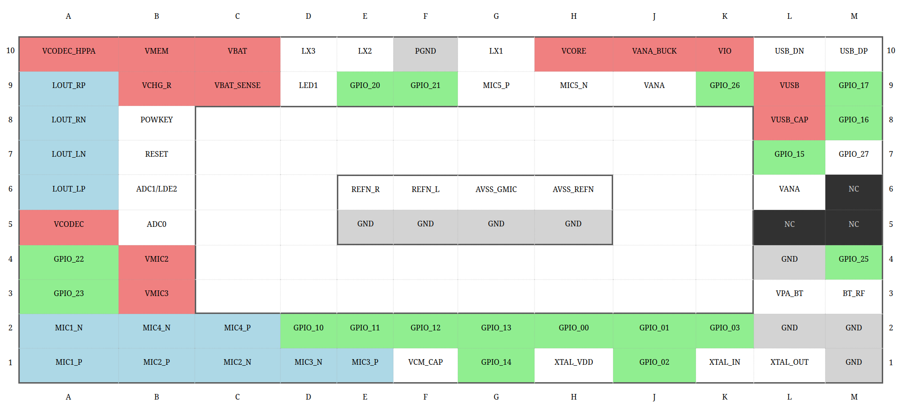


## Table of Contents

- [Overview](#overview)
- [Pin Descriptions](#pin-descriptions)
- [Contributing](#contributing)
- [BGA layout](#bga-layout)
- [License](#license)

# Overview

This repository contains the schematic symbols for the BES2300-YP chip, an ANC Bluetooth Audio Platform with IBRT for True Wireless Stereo (TWS) applications. These symbols are designed to be used with the KiCad EDA (Electronic Design Automation) software.

_Footprints and 3D models are not yet available, contributations are welcome._

Please note that while every effort has been made to ensure accuracy, the symbols provided in this library may contain errors or inaccuracies. The contributors and maintainers of this library cannot guarantee the correctness or completeness of the information provided. Therefore, users are advised to independently verify the symbols and designs before use.

# Contributing

Contributions to improve the accuracy and completeness of the symbols are welcome and encouraged. If you discover any errors or have suggestions for improvements, please consider contributing by submitting a pull request. By contributing to this repository, you agree to license your contributions under the same terms as the original project.

# Pin Descriptions

| Pin        | Number  | Type   | Description                                         |
|------------|------|-------|-----------------------------------------------------|
| **Clock Signals**  |      |       |                                                     |
| XTAL_OUT   | L1   | Analog| Reference 26MHz crystal port                         |
| XTAL_IN    | K1   | Analog| Reference 26MHz crystal port                         |
| **PMU**        |      |       |                                                     |
| VBAT_SENSE | C9   | Analog| VBAT sense pin                                       |
| VMEM       | B10  | Analog| 1.2~2.7V internal memory ldo with decap              |
| VIO        | K10  | Analog| 1.2~3.3V gpio ldo with decap                         |
| VANA       | J9   | Analog| 1.0~1.8V analog ldo with decap                       |
| VCODEC     | A5   | Analog| 1.2~2V codec ldo with decap                          |
| VPA_BT     | L3   | Analog| BT_RFPA power supply                                 |
| VANA       | L6   | Analog| BT analog power supply                               |
| XTAL_VDD   | H1   | Analog| 26MHz reference crystal power supply                 |
| VCORE      | H10  | Analog| 0.3~1.3V digital core ldo with decap                 |
| LX3        | D10  | Analog| Buck dcdc switch pin3                                |
| Vcodec_hppa| A10  | Analog| Audio PA power supply                                |
| LX1        | G10  | Analog| Buck dcdc switch pin1                                |
| LX2        | E10  | Analog| Buck dcdc switch pin2                                |
| VANA_BUCK  | J10  | Analog| Buck dcdc analog output pin                          |
| VBAT       | C10  | Analog| Chip power supply                                    |
| VUSB_CAP   | L8   | Analog| 0.9v ldo with decap                                  |
| VUSB       | L9   | Analog| 2.4~3.9V usb ldo with decap                          |
| **PMU Interface**  |  |       |                                                     |
| VCHG_R     | B9   | Analog| Vbus voltage detector                                |
| ADC0       | B5   | Analog| GPADC                                               |
| LED2       | B6   | Analog| LED Driver                                          |
| LED1       | D9   | Analog| LED driver                                          |
| **Digital Interface**  | |       |                                                     |
| POWKEY     | B8   | I     | Chip power on input, high level/ high pulse (min 10ms) is active |
| RESET      | B7   | I     | Chip reset pin, reset if the duration of reset above 2v > 500ms |
| GPIO_00    | H2   | I/O   | I2S_SDI                                             |
| GPIO_01    | J2   | I/O   | I2S_SDO                                             |
| GPIO_02    | J1   | I/O   | I2S_WS                                              |
| GPIO_03    | K2   | I/O   | I2S_SCK                                             |
| GPIO_15    | L7   | I/O   | GPIO                                                |
| GPIO_26    | K9   | I/O   | GPIO                                                |
| GPIO_10    | D2   | I/O   | SSD_D2                                              |
| GPIO_27    | M7   | I/O   | GPIO                                                |
| GPIO_11    | E2   | I/O   | SSD_D3                                              |
| GPIO_12    | F2   | I/O   | SSD_CMD                                             |
| GPIO_13    | G2   | I/O   | SSD_CLK                                             |
| GPIO_14    | G1   | I/O   | SSD_D0                                              |
| GPIO_20    | E9   | I/O   | UART1_RXD                                           |
| GPIO_21    | F9   | I/O   | UART1_TXD                                           |
| GPIO_22    | A4   | I/O   | GPIO                                                |
| GPIO_23    | A3   | I/O   | GPIO                                                |
| GPIO_25    | M4   | I/O   | GPIO                                                |
| GPIO_17    | M9   | I/O   | UART0_TXD/GPIO_17                                   |
| GPIO_16    | M8   | I/O   | UART0_RXD/GPIO_16                                   |
| **Audio interface**  |  |       |                                                     |
| MIC1_N     | A2   | Analog| MIC 1 N port                                        |
| MIC1_P     | A1   | Analog| MIC 1 P port                                        |
| MIC2_N     | C1   | Analog| MIC 2 N port                                        |
| MIC2_P     | B1   | Analog| MIC 2 P port                                        |
| MIC3_N     | D1   | Analog| MIC 3 N port                                        |
| MIC3_P     | E1   | Analog| MIC 3 P port                                        |
| MIC4_N     | B2   | Analog| MIC 4 N port                                        |
| MIC4_P     | C2   | Analog| MIC 4 P port                                        |
| MIC5_N     | H9   | Analog| MIC 5 N port                                        |
| MIC5_P     | G9   | Analog| MIC 5 P port                                        |
| VMIC2      | B4   | Analog| MIC BIAS2 decap                                     |
| VMIC3      | B3   | Analog| MIC BIAS3 decap                                     |
| LOUT_LN    | A7   | Analog| Speaker output negative, left                       |
| LOUT_LP    | A6   | Analog| Speaker output positive, left                       |
| LOUT_RN    | A8   | Analog| Speaker output negative, right                      |
| LOUT_RP    | A9   | Analog| Speaker output positive, right                      |
| VCM_CAP    | F1   | Analog| Decoupling of audio reference                       |
| **RF Interface** |    |       |                                                     |
| BT_RF      | M3   | Analog| Bluetooth transmitter output /receiver input        |
| **USB Interface** |   |       |                                                     |
| USB_DN     | L10  | Analog| USB data minus                                      |
| USB_DP     | M10  | Analog| USB data plus                                       |
| **Ground**     |      |       |                                                     |
| PGND       | F10  | Analog| PMU GND                                             |
| GND        | F5   | Analog| Chip GND                                            |
| GND        | G5   | Analog| Chip GND                                            |
| GND        | H5   | Analog| Chip GND                                            |
| GND        | L2   | Analog| Chip GND                                            |
| GND        | M2   | Analog| Chip GND                                            |
| GND        | M10  | Analog| Chip GND                                            |
| GND        | L4   | Analog| Chip GND                                            |
| AVSS_GMC   | G6   | Analog| For MIC5 Low power ADC GND                          |
| AVSS_REFN  | H6   | Analog| Audio reference GND                                 |
| REFN_R     | E6   | Analog| Speaker output reference GND, right                 |
| REFN_L     | F6   | Analog| Speaker output reference GND, left                  |
| **NC**         |      |       |                                                     |
| NC         | M5   | NC    | Leave unconnected                                   |
| NC         | M6   | NC    | Leave unconnected                                   |
| NC         | L5   | NC    | Leave unconnected                                   

# BGA Layout

The BGA pads are layed out as follows:

This is also available here as an HTML page: [Link Text](https://jeffalyanak.github.io/bes2300yp-kicad/docs/bga_diagram.html)

# License

Licensed under GNU GPL 2.0. See [License](LICENSE.md).